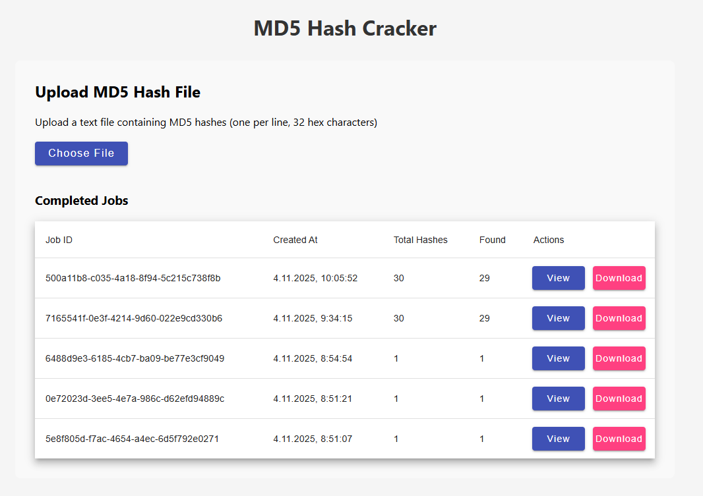
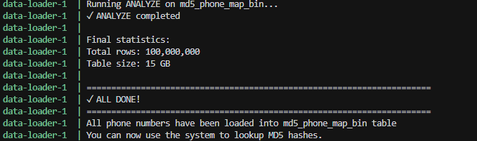
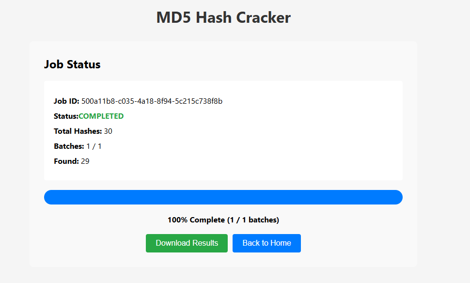

# MD5 Hash Cracker System

A distributed system for looking up phone numbers from MD5 hashes using Angular UI, Spring Boot (Master/Minion), RabbitMQ, and PostgreSQL.

## Solution Explanation

### Overview

This system solves the problem of efficiently looking up phone numbers from MD5 hashes at scale. The solution uses a **distributed architecture** to handle large-scale hash lookups by:

1. **Precomputing MD5 hashes**: All possible phone number MD5 hashes are precomputed and stored in PostgreSQL
2. **Distributed processing**: Work is distributed across multiple worker nodes (minions) using RabbitMQ
3. **Batch processing**: Large input files are split into manageable batches for parallel processing
4. **Real-time monitoring**: Progress updates are streamed via Server-Sent Events (SSE)

### How It Works

#### Data Flow

```
1. User uploads file with MD5 hashes
   ↓
2. Master service validates and splits into batches (1000 hashes each)
   ↓
3. Batches published to RabbitMQ queue
   ↓
4. Minion workers consume batches from queue
   ↓
5. Each minion performs database lookup (batch IN query)
   ↓
6. Found results stored in PostgreSQL results table
   ↓
7. Result batches sent back to Master via RabbitMQ
   ↓
8. Master aggregates results and updates job progress
   ↓
9. User receives real-time progress updates via SSE
   ↓
10. User downloads final results CSV
```

#### Key Design Decisions

1. **Precomputed Hash Table**: Instead of computing MD5 hashes on-the-fly, we precompute all possible phone number MD5 hashes and store them in a PostgreSQL table. This allows for O(1) lookup time per hash.

2. **Binary Storage**: MD5 hashes are stored as `BYTEA` (16 bytes) instead of hex strings (32 characters), saving ~50% storage space and improving query performance.

3. **Batch Processing**: Hashes are processed in batches of 1000 to:
   - Reduce database round-trips
   - Enable parallel processing across multiple minions
   - Improve throughput

4. **Message Queue**: RabbitMQ ensures:
   - Reliable delivery (messages persist if minion crashes)
   - Load balancing across minions
   - Horizontal scalability (add more minions as needed)

5. **Asynchronous Processing**: Jobs are processed asynchronously, allowing the system to handle large files without blocking the API.

6. **Idempotency**: All database writes use `ON CONFLICT DO NOTHING` to handle duplicate messages safely.

### Architecture

- **Angular UI**: Upload MD5 files and monitor job progress with real-time updates (SSE)
- **Spring Boot Master**: Accepts file uploads, splits into batches, publishes to RabbitMQ, aggregates results
- **Spring Boot Minion**: Consumes batches from RabbitMQ, performs database lookups, publishes results
- **RabbitMQ**: Message queue for distributing work batches
- **PostgreSQL**: Stores precomputed MD5 hash map (100M+ rows) and job results

## Prerequisites

- Docker & Docker Compose
- Java 21 (for local development)
- Node 18+ / Angular CLI (for UI development)
- PostgreSQL client (psql) for data loading

## Quick Start

### 1. Start All Services

```bash
docker compose up --build
```

This will start:
- PostgreSQL on port 5432
- Adminer (Database Admin UI) on port 8081
- RabbitMQ on port 5672 (Management UI on 15672)
- Master service on port 8080
- Minion service (2 replicas)
- UI on port 4200

### 2. Load Precomputed Data (One-Time)

#### Generate Precomputed CSV Files

```bash
cd db/load

# Generate 10M rows for prefix 050 (single file)
python3 generate_precomp.py --prefix 050 --start 0 --count 10000000 --out precomp_050.csv

# Generate in parallel (recommended for large datasets)
python3 generate_precomp.py --prefix 050 --parallel 10 --count 10000000 --out-dir ./precomp_data

# Generate for multiple prefixes
for prefix in 050 051 052 053 054; do
  python3 generate_precomp.py --prefix $prefix --parallel 10 --count 10000000 --out-dir ./precomp_data
done
```

#### Load Data into PostgreSQL

```bash
# Make scripts executable (Linux/Mac)
chmod +x db/load/*.sh

# Load a single file
./db/load/load_data.sh precomp_050.csv md5db md5

# Load all files from a directory
./db/load/load_all.sh ./precomp_data md5db md5

# Or manually using psql
psql -d md5db -U md5 -c "\COPY staging_md5(md5_hex, phone_number) FROM 'precomp_050.csv' WITH CSV"
psql -d md5db -U md5 -c "INSERT INTO md5_phone_map_bin (md5_hash, phone_number) SELECT decode(md5_hex, 'hex'), phone_number FROM staging_md5 ON CONFLICT DO NOTHING;"
psql -d md5db -U md5 -c "TRUNCATE staging_md5;"
psql -d md5db -U md5 -c "ANALYZE md5_phone_map_bin;"
```

### 3. Use the System

#### 3.1. Access the Web UI

Open http://localhost:4200 in your browser.



The UI provides:
- **File Upload**: Drag and drop or select a text file with MD5 hashes
- **Real-time Progress**: Watch job progress with live updates
- **Results Download**: Download completed results as CSV

#### 3.2. Access Database Admin (Adminer)

Open http://localhost:8081
- **System**: PostgreSQL
- **Server**: postgres
- **Username**: md5
- **Password**: md5pass
- **Database**: md5db

Use Adminer to:
- Inspect database tables
- Run SQL queries
- Monitor data loading progress
- Check job status

#### 3.3. Access RabbitMQ Management

Open http://localhost:15672
- **Username**: md5
- **Password**: md5pass

Monitor:
- Queue depths
- Message rates
- Consumer status
- System health

#### 3.4. Upload and Process Hash File

1. **Prepare Hash File**: Create a text file with MD5 hashes (one per line, 32 hex characters)
   ```
   9b8ecefdcb3a2933eb717f83ff77a320
   1234567890abcdef1234567890abcdef
   ```

2. **Upload File**: Use the UI or API to upload the file
   - Via UI: Click "Choose File" and select your hash file
   - Via API: `curl -X POST -F "file=@hashes.txt" http://localhost:8080/api/jobs`

3. **Monitor Progress**: Watch real-time progress updates
   

4. **View Results**: Once complete, view the job details
   

5. **Download Results**: Download the CSV file with all results (found and not found)

#### 3.5. Verify Data Loading

Check that precomputed data is loaded:


Query the database:
```sql
SELECT COUNT(*) FROM md5_phone_map_bin;
-- Should show 100,000,000 rows
```

### 4. API Usage

The Master service provides a REST API for job management. All endpoints are prefixed with `/api/jobs`.

#### 4.1. Upload Hash File (Create Job)

**Endpoint**: `POST /api/jobs`  
**Content-Type**: `multipart/form-data`

Upload a text file containing MD5 hashes (one per line, 32 hex characters).

**Request Example**:
```bash
curl -X POST \
  -F "file=@test_hashes.txt" \
  http://localhost:8080/api/jobs
```

**Request with verbose output**:
```bash
curl -v -X POST \
  -F "file=@test_hashes.txt" \
  http://localhost:8080/api/jobs
```

**Example File Content** (`test_hashes.txt`):
```
d41d8cd98f00b204e9800998ecf8427e
5d41402abc4b2a76b9719d911017c592
098f6bcd4621d373cade4e832627b4f6
a1b2c3d4e5f6789012345678901234ab
```

**Response** (HTTP 202 Accepted):
```json
{
  "jobId": "550e8400-e29b-41d4-a716-446655440000"
}
```

**Error Response** (HTTP 400 Bad Request):
```json
{
  "error": "Invalid file format",
  "message": "File must contain valid MD5 hashes (32 hex characters per line)"
}
```

#### 4.2. Get Job Status

**Endpoint**: `GET /api/jobs/{jobId}`

Retrieve the current status and progress of a job.

**Request Example**:
```bash
curl http://localhost:8080/api/jobs/550e8400-e29b-41d4-a716-446655440000
```

**Response** (HTTP 200 OK):
```json
{
  "jobId": "550e8400-e29b-41d4-a716-446655440000",
  "status": "RUNNING",
  "totalHashes": 4,
  "batchesExpected": 1,
  "batchesCompleted": 0,
  "foundCount": 0,
  "createdAt": "2024-01-15T10:30:00Z"
}
```

**Status Values**:
- `RUNNING`: Job is being processed
- `COMPLETED`: All batches have been processed
- `FAILED`: Job encountered an error (rare)

**Response for Completed Job**:
```json
{
  "jobId": "550e8400-e29b-41d4-a716-446655440000",
  "status": "COMPLETED",
  "totalHashes": 4,
  "batchesExpected": 1,
  "batchesCompleted": 1,
  "foundCount": 2,
  "createdAt": "2024-01-15T10:30:00Z"
}
```

#### 4.3. Stream Progress Events (SSE)

**Endpoint**: `GET /api/jobs/{jobId}/events`  
**Content-Type**: `text/event-stream`

Stream real-time progress updates using Server-Sent Events (SSE). The connection remains open until the job completes.

**Request Example**:
```bash
curl -N http://localhost:8080/api/jobs/550e8400-e29b-41d4-a716-446655440000/events
```

**Response Stream**:
```
event: progress
data: {"batchesCompleted":1,"batchesExpected":1,"foundCount":2}

event: completed
data: {"jobId":"550e8400-e29b-41d4-a716-446655440000"}

```

**Event Types**:
- `job_created`: Job was created (emitted immediately after upload)
- `progress`: Progress update with current batch completion and found count
- `completed`: Job has finished processing all batches

**Using in JavaScript** (for reference):
```javascript
const eventSource = new EventSource(`http://localhost:8080/api/jobs/${jobId}/events`);
eventSource.onmessage = (event) => {
  const data = JSON.parse(event.data);
  console.log('Progress:', data);
};
eventSource.addEventListener('completed', () => {
  eventSource.close();
});
```

#### 4.4. Download Results

**Endpoint**: `GET /api/jobs/{jobId}/results`  
**Content-Type**: `text/csv`

Download the complete results as a CSV file. Each row contains the original hash and the corresponding phone number (or "NOT FOUND").

**Request Example**:
```bash
curl http://localhost:8080/api/jobs/550e8400-e29b-41d4-a716-446655440000/results \
  -o results.csv
```

**Request with headers shown**:
```bash
curl -v http://localhost:8080/api/jobs/550e8400-e29b-41d4-a716-446655440000/results \
  -o results.csv
```

**Response** (HTTP 200 OK):
```
hash,phone
d41d8cd98f00b204e9800998ecf8427e,NOT FOUND
5d41402abc4b2a76b9719d911017c592,0501234567
098f6bcd4621d373cade4e832627b4f6,NOT FOUND
a1b2c3d4e5f6789012345678901234ab,0519876543
```

**CSV Format**:
- Header row: `hash,phone`
- Each row: `<32-char-hex-hash>,<11-digit-phone-or-NOT-FOUND>`
- Results are ordered by hash (alphabetically)

**Error Response** (HTTP 404 Not Found):
```json
{
  "error": "Job not found",
  "message": "Job ID 550e8400-e29b-41d4-a716-446655440000 does not exist"
}
```

#### 4.5. List All Jobs (Optional)

**Endpoint**: `GET /api/jobs`

Currently returns an empty list. Can be extended for job listing functionality.

**Request Example**:
```bash
curl http://localhost:8080/api/jobs
```

**Response**:
```json
[]
```

#### Complete Workflow Example

Here's a complete example of using the API to process a hash file:

```bash
# 1. Create a test file
cat > test_hashes.txt << EOF
d41d8cd98f00b204e9800998ecf8427e
5d41402abc4b2a76b9719d911017c592
098f6bcd4621d373cade4e832627b4f6
EOF

# 2. Upload the file and capture job ID
JOB_ID=$(curl -s -X POST -F "file=@test_hashes.txt" \
  http://localhost:8080/api/jobs | jq -r '.jobId')

echo "Job ID: $JOB_ID"

# 3. Monitor progress (in another terminal or background)
curl -N http://localhost:8080/api/jobs/$JOB_ID/events &

# 4. Poll job status until complete
while true; do
  STATUS=$(curl -s http://localhost:8080/api/jobs/$JOB_ID | jq -r '.status')
  echo "Status: $STATUS"
  
  if [ "$STATUS" = "COMPLETED" ]; then
    break
  fi
  
  sleep 2
done

# 5. Download results
curl http://localhost:8080/api/jobs/$JOB_ID/results -o results.csv

# 6. View results
cat results.csv
```

#### API Response Times

- **Upload**: Typically < 1 second for files up to 10MB
- **Status Check**: < 100ms
- **Results Download**: Depends on result size (typically < 1 second for < 10MB CSV)
- **SSE Events**: Real-time (emitted as batches complete)

#### Error Handling

All endpoints return appropriate HTTP status codes:
- `200 OK`: Successful request
- `202 Accepted`: Job created (upload endpoint)
- `400 Bad Request`: Invalid input (e.g., malformed file)
- `404 Not Found`: Job ID doesn't exist
- `500 Internal Server Error`: Server error (check logs)

## Project Structure

```
md5-hash/
├── docker-compose.yml          # Full stack orchestration
├── db/
│   ├── ddl/
│   │   └── create_tables.sql   # Database schema
│   └── load/
│       ├── generate_precomp.py # Generate precomputed CSV files
│       ├── load_all_numbers.py # Automated data loading with state tracking
│       ├── load_data.sh        # Load single CSV file
│       └── load_all.sh         # Load all CSVs from directory
├── master/                      # Spring Boot master service
│   ├── src/
│   │   ├── main/java/...       # Source code
│   │   └── test/java/...       # Unit and integration tests
│   ├── Dockerfile
│   └── pom.xml
├── minion/                      # Spring Boot minion service
│   ├── src/
│   │   ├── main/java/...       # Source code
│   │   └── test/java/...       # Unit and integration tests
│   ├── Dockerfile
│   └── pom.xml
├── ui/                          # Angular application
│   ├── src/
│   ├── Dockerfile
│   └── package.json
├── docs/                        # Documentation images
│   ├── home.png
│   ├── loader-completed.png
│   ├── view-finished-job.png
│   └── 100000000 records.png
└── README.md
```

## Database Schema

### Main Tables

- **md5_phone_map_bin**: Precomputed MD5 hashes (BYTEA) → phone numbers
- **jobs**: Job tracking (status, progress, counts)
- **targets**: Original input hashes per job
- **results**: Lookup results (found phone numbers)

See `db/ddl/create_tables.sql` for complete schema.

## Configuration

### Environment Variables

#### Master Service
- `SPRING_DATASOURCE_URL`: PostgreSQL connection URL
- `SPRING_DATASOURCE_USERNAME`: Database username
- `SPRING_DATASOURCE_PASSWORD`: Database password
- `SPRING_RABBITMQ_HOST`: RabbitMQ host
- `SPRING_RABBITMQ_PORT`: RabbitMQ port (default: 5672)
- `SPRING_RABBITMQ_USERNAME`: RabbitMQ username
- `SPRING_RABBITMQ_PASSWORD`: RabbitMQ password

#### Minion Service
- Same as master, plus:
- `SPRING_RABBITMQ_LISTENER_SIMPLE_CONCURRENCY`: Number of concurrent consumers (default: 4)

### Batch Size

Default batch size is 1000 hashes per batch. Adjust in `master/src/main/java/com/md5cracker/service/JobService.java`:

```java
private static final int BATCH_SIZE = 1000; // Change as needed
```

## Performance Tuning

### PostgreSQL

Edit `postgresql.conf` or use environment variables:

```sql
shared_buffers = 4GB              # 25% of RAM
effective_cache_size = 12GB       # 70-80% of RAM
random_page_cost = 1.1            # For SSD
work_mem = 64MB                   # Per operation
max_connections = 100
```

### RabbitMQ

- Increase prefetch for faster processing: `spring.rabbitmq.listener.simple.prefetch=50`
- Adjust concurrency: `spring.rabbitmq.listener.simple.concurrency=8`

### Minion Scaling

Scale minions in docker-compose:

```bash
docker compose up --scale minion=4
```

Or edit `docker-compose.yml`:

```yaml
minion:
  deploy:
    replicas: 4
```

## Testing

The project includes comprehensive test suites covering unit tests, integration tests, and failure scenarios.

### Test Structure

```
master/src/test/
├── java/com/md5cracker/
│   ├── controller/          # Controller unit tests
│   ├── repository/          # Repository unit tests
│   ├── service/             # Service unit tests
│   └── integration/         # Integration tests with H2 database
│       ├── JobServiceIntegrationTest.java
│       └── FailureScenarioIntegrationTest.java
└── resources/
    ├── application-test.yml # H2 test configuration
    └── schema.sql           # H2 test schema

minion/src/test/
├── java/com/md5cracker/
│   ├── listener/            # Listener unit tests
│   ├── service/             # Service unit tests
│   └── integration/         # Integration tests with H2 database
│       └── ResultServiceIntegrationTest.java
└── resources/
    ├── application-test.yml # H2 test configuration
    └── schema.sql           # H2 test schema
```

### Running Tests

#### Run All Tests

**Master Service:**
```bash
cd master
mvn test
```

**Minion Service:**
```bash
cd minion
mvn test
```

#### Run Specific Test Classes

**Integration Tests:**
```bash
# Master service integration tests
cd master
mvn test -Dtest=*IntegrationTest

# Minion service integration tests
cd minion
mvn test -Dtest=*IntegrationTest
```

**Unit Tests:**
```bash
# Master service unit tests
cd master
mvn test -Dtest=*Test -Dtest=!*IntegrationTest

# Minion service unit tests
cd minion
mvn test -Dtest=*Test -Dtest=!*IntegrationTest
```

#### Run Specific Test Methods

```bash
# Run a specific test method
mvn test -Dtest=JobServiceTest#createJob_ValidFile_CreatesJobAndStoresTargets

# Run all tests in a specific class
mvn test -Dtest=JobServiceIntegrationTest
```

### Test Coverage

#### Unit Tests (Mock-based)

- **JobControllerTest**: Tests all REST API endpoints
- **JobServiceTest**: Tests job creation, CSV generation, result handling
- **JobRepositoryTest**: Tests database CRUD operations
- **JobEventPublisherTest**: Tests SSE event publishing
- **HashLookupServiceTest**: Tests hash lookup logic
- **ResultServiceTest**: Tests result processing and publishing
- **HashBatchListenerTest**: Tests message queue listener

#### Integration Tests (H2 Database)

- **JobServiceIntegrationTest**: 
  - Real database operations
  - Job creation and target storage
  - Result batch processing
  - CSV generation
  - Progress tracking
  - Database failure handling

- **ResultServiceIntegrationTest**:
  - Batch processing with database
  - Found/not found scenarios
  - Idempotency testing
  - Large batch handling
  - Invalid data handling

- **FailureScenarioIntegrationTest**:
  - Database failures during processing
  - Foreign key constraint violations
  - Transaction rollbacks
  - Concurrent batch processing
  - Partial failures
  - Duplicate batch handling
  - Missing job handling

### Test Configuration

Tests use **H2 in-memory database** (PostgreSQL mode) for:
- Fast test execution
- No external dependencies
- Automatic cleanup
- Transaction rollback per test

**Test Configuration** (`application-test.yml`):
```yaml
spring:
  datasource:
    url: jdbc:h2:mem:testdb;MODE=PostgreSQL
  rabbitmq:
    listener:
      simple:
        auto-startup: false  # Disable RabbitMQ for unit tests
```

### Test Data

Test data is automatically set up in `@BeforeEach` methods:
- Sample MD5 hashes
- Phone numbers in `md5_phone_map_bin` table
- Job records for integration testing

### Failure Scenario Testing

The integration tests specifically cover:

1. **Database Failures**: Table drops, connection issues
2. **Data Integrity**: Foreign key violations, partial inserts
3. **Concurrent Processing**: Race conditions, duplicate batches
4. **Invalid Data**: Malformed hashes, binary data, empty files
5. **Missing Entities**: Non-existent jobs, orphaned batches
6. **Transaction Rollbacks**: Ensuring data consistency

### Example: Running Integration Tests

```bash
# Run all integration tests for master service
cd master
mvn test -Dtest=*IntegrationTest

# Expected output:
# [INFO] Tests run: 10, Failures: 0, Errors: 0, Skipped: 0
```

### Test Best Practices

1. **Isolation**: Each test is transactional and rolls back after execution
2. **Real Database**: Integration tests use H2 (PostgreSQL mode) for real SQL execution
3. **Failure Injection**: Tests simulate failures by dropping tables or corrupting data
4. **Cleanup**: Tests restore state in `finally` blocks
5. **Assertions**: Tests verify both success and failure paths

### Small-Scale System Test

1. Generate test data (10k rows):
```bash
python3 db/load/generate_precomp.py --prefix 050 --start 0 --count 10000 --out test_data.csv
./db/load/load_data.sh test_data.csv
```

2. Create test input file `test_hashes.txt`:
```
a1b2c3d4e5f6789012345678901234ab
9b8ecefdcb3a2933eb717f83ff77a320  # MD5 of "050-1234567"
```

3. Upload via UI or API and verify results

### Performance Testing

For load testing, use the generated test data:
```bash
# Generate 100M records (as configured)
docker compose up data-loader

# Upload large hash file
curl -X POST -F "file=@large_hashes.txt" http://localhost:8080/api/jobs
```

## Monitoring

### Health Checks

- Master: http://localhost:8080/actuator/health
- Minion: http://localhost:8081/actuator/health
- RabbitMQ: http://localhost:15672 (user: md5, pass: md5pass)

### Metrics

- Prometheus: http://localhost:8080/actuator/prometheus

### Database Monitoring

```sql
-- Check index usage
SELECT * FROM pg_stat_user_indexes WHERE tablename = 'md5_phone_map_bin';

-- Slow queries
SELECT * FROM pg_stat_statements ORDER BY total_time DESC LIMIT 10;

-- Table size
SELECT pg_size_pretty(pg_total_relation_size('md5_phone_map_bin'));
```

## Production Considerations

### Security

1. **API Authentication**: Add JWT or API key authentication to master endpoints
2. **RabbitMQ**: Use TLS, secure credentials, vhosts
3. **PostgreSQL**: Strong passwords, network restrictions, SSL
4. **Rate Limiting**: Add rate limiting on upload endpoint
5. **CORS**: Configure CORS properly for production domains

### Backup & Recovery

- Regular PostgreSQL backups (pg_dump)
- RabbitMQ queue persistence
- Consider job result archival

### High Availability

- PostgreSQL: Master-replica setup
- RabbitMQ: Cluster mode
- Load balancer for master/minion services
- Kubernetes deployment for better scaling

## Troubleshooting

### Minion not processing batches

- Check RabbitMQ queues: http://localhost:15672
- Verify database connection
- Check minion logs: `docker compose logs minion`

### Slow lookups

- Verify indexes exist: `\d md5_phone_map_bin` in psql
- Check PostgreSQL connection pool size
- Monitor database CPU/memory
- Consider increasing batch size (if DB can handle)

### SSE not working

- Check browser console for errors
- Verify master service is running
- Check nginx proxy configuration (if using)

## Development

### Local Development (without Docker)

#### Master/Minion

```bash
# Master service
cd master
mvn spring-boot:run -Dspring-boot.run.profiles=master

# Minion service (in another terminal)
cd minion
mvn spring-boot:run -Dspring-boot.run.profiles=minion
```

**Prerequisites for local dev:**
- PostgreSQL running on localhost:5432
- RabbitMQ running on localhost:5672
- Database `md5db` created with schema from `db/ddl/create_tables.sql`

#### UI

```bash
cd ui
npm install
npm start  # Runs on http://localhost:4200
```

**Note**: Update `ui/src/app/api.service.ts` base URL to `http://localhost:8080/api` for local dev.

### Running Tests During Development

#### Continuous Testing

```bash
# Watch mode - rerun tests on file changes
cd master
mvn test -Dtest=*Test -Dmaven.test.skip=false

# Run specific test class
mvn test -Dtest=JobServiceIntegrationTest
```

#### Test Coverage

```bash
# Generate test coverage report (requires jacoco plugin)
mvn clean test jacoco:report
# Report available at: target/site/jacoco/index.html
```

### Debugging Tests

#### Debug Mode in IDE

1. Set breakpoints in test or source code
2. Run test in debug mode
3. Step through code execution

#### Debug with Maven

```bash
mvn test -Dmaven.surefire.debug="-Xdebug -Xrunjdwp:transport=dt_socket,server=y,suspend=y,address=5005"
```

Then attach debugger to port 5005.

### Code Quality

```bash
# Check code style
mvn checkstyle:check

# Run static analysis
mvn sonar:sonar
```

## Next Steps

This section outlines potential enhancements and future improvements for the MD5 Hash Cracker system.

### UI Improvements

#### Enhanced Progress Visualization

**Current State**: Basic progress bar showing batch completion percentage.

**Proposed Improvements**:

1. **Realistic Progress Indicators**:
   - **Time-based Progress**: Estimate completion time based on processing rate
   - **Throughput Metrics**: Show hashes processed per second
   - **Visual Progress Bar**: Animated progress bar with percentage and ETA
   - **Batch-level Progress**: Show individual batch processing status
   - **Historical Performance**: Display average processing speed from previous jobs

2. **Enhanced Dashboard**:
   - **Job History**: List of all previous jobs with status and results
   - **Statistics Panel**: Total hashes processed, success rate, average processing time
   - **Charts and Graphs**: Visual representation of processing speed over time
   - **Real-time Metrics**: Live updates of active jobs, queue depths, worker status

3. **Better User Experience**:
   - **Drag & Drop Upload**: Enhanced file upload with preview
   - **Job Details View**: Expandable job cards showing detailed information
   - **Filtering & Search**: Search jobs by ID, date, status
   - **Export Options**: Multiple export formats (CSV, JSON, Excel)
   - **Notifications**: Browser notifications when jobs complete

**Example UI Enhancements**:
```typescript
// Enhanced progress component with ETA calculation
interface ProgressData {
  batchesCompleted: number;
  batchesExpected: number;
  foundCount: number;
  totalHashes: number;
  processingRate: number;  // hashes/second
  estimatedTimeRemaining: number;  // seconds
  startTime: Date;
}
```

### Multi-Hash Algorithm Support

#### Architecture Overview

Extend the system to support multiple hash algorithms (MD5, SHA-1, SHA-256, SHA-512, etc.) with automatic detection.

#### Database Schema Extensions

**Enhanced `md5_phone_map_bin` table**:
```sql
CREATE TABLE phone_hash_map (
  phone_number CHAR(11) NOT NULL,
  md5_hash BYTEA,
  sha1_hash BYTEA,
  sha256_hash BYTEA,
  sha512_hash BYTEA,
  PRIMARY KEY (phone_number)
);

-- Indexes for each hash type
CREATE INDEX idx_phone_hash_md5 ON phone_hash_map(md5_hash);
CREATE INDEX idx_phone_hash_sha1 ON phone_hash_map(sha1_hash);
CREATE INDEX idx_phone_hash_sha256 ON phone_hash_map(sha256_hash);
CREATE INDEX idx_phone_hash_sha512 ON phone_hash_map(sha512_hash);
```

**Benefits**:
- Single source of truth for all hash types
- Efficient lookups with algorithm-specific indexes
- Reduced storage (one phone number, multiple hash columns)
- Faster queries (no need to compute hashes on-the-fly)

#### Automatic Hash Algorithm Detection

**Detection Logic**:
```java
public enum HashAlgorithm {
    MD5(32, "^[a-fA-F0-9]{32}$"),
    SHA1(40, "^[a-fA-F0-9]{40}$"),
    SHA256(64, "^[a-fA-F0-9]{64}$"),
    SHA512(128, "^[a-fA-F0-9]{128}$");
    
    private final int hexLength;
    private final Pattern pattern;
    
    public static HashAlgorithm detect(String hash) {
        String cleanHash = hash.trim();
        for (HashAlgorithm algo : values()) {
            if (algo.pattern.matcher(cleanHash).matches()) {
                return algo;
            }
        }
        throw new IllegalArgumentException("Unknown hash algorithm: " + hash);
    }
}
```

**Implementation Strategy**:

1. **Hash Detection Service**:
   ```java
   @Service
   public class HashDetectionService {
       public HashAlgorithm detectAlgorithm(String hash) {
           // Pattern-based detection
           // Length-based detection
           // Character set validation
       }
       
       public boolean isHashValid(String hash, HashAlgorithm algorithm) {
           // Validate hash format
       }
   }
   ```

2. **Enhanced Job Service**:
   ```java
   public UUID createJob(MultipartFile file) {
       // Detect hash algorithm from first few lines
       HashAlgorithm algorithm = detectHashAlgorithm(file);
       
       // Store algorithm in job record
       jobRepository.createJob(jobId, hashes.size(), algorithm);
       
       // Process based on detected algorithm
       processHashes(hashes, algorithm);
   }
   ```

3. **Multi-Algorithm Lookup**:
   ```java
   public Map<String, String> lookupBatch(
       List<String> hashes, 
       HashAlgorithm algorithm
   ) {
       String columnName = getHashColumnName(algorithm); // md5_hash, sha1_hash, etc.
       String sql = String.format(
           "SELECT phone_number, %s FROM phone_hash_map WHERE %s IN (?)",
           columnName, columnName
       );
       // Execute query with binary hash comparison
   }
   ```

#### Data Generation for Multiple Algorithms

**Enhanced Generator Script**:
```python
def generate_hashes(phone_number):
    """Generate all hash types for a phone number."""
    return {
        'phone': phone_number,
        'md5': hashlib.md5(phone.encode()).hexdigest(),
        'sha1': hashlib.sha1(phone.encode()).hexdigest(),
        'sha256': hashlib.sha256(phone.encode()).hexdigest(),
        'sha512': hashlib.sha512(phone.encode()).hexdigest()
    }
```

**Loading Script Enhancement**:
```python
# Load all hash types into database
def load_multi_hash_csv(csv_file):
    """Load CSV with all hash types."""
    for row in csv_reader:
        jdbcTemplate.update("""
            INSERT INTO phone_hash_map 
            (phone_number, md5_hash, sha1_hash, sha256_hash, sha512_hash)
            VALUES (?, decode(?, 'hex'), decode(?, 'hex'), decode(?, 'hex'), decode(?, 'hex'))
            ON CONFLICT (phone_number) DO UPDATE
            SET md5_hash = EXCLUDED.md5_hash,
                sha1_hash = EXCLUDED.sha1_hash,
                sha256_hash = EXCLUDED.sha256_hash,
                sha512_hash = EXCLUDED.sha512_hash
        """, row['phone'], row['md5'], row['sha1'], row['sha256'], row['sha512'])
```

#### API Extensions

**Enhanced Upload Endpoint**:
```java
@PostMapping(consumes = MediaType.MULTIPART_FORM_DATA_VALUE)
public ResponseEntity<?> upload(
    @RequestParam("file") MultipartFile file,
    @RequestParam(value = "algorithm", required = false) String algorithmHint
) {
    // Auto-detect algorithm or use hint
    HashAlgorithm algorithm = algorithmHint != null 
        ? HashAlgorithm.valueOf(algorithmHint.toUpperCase())
        : hashDetectionService.detectAlgorithm(file);
    
    UUID jobId = jobService.createJob(file, algorithm);
    return ResponseEntity.accepted().body(Map.of(
        "jobId", jobId.toString(),
        "detectedAlgorithm", algorithm.name()
    ));
}
```

**Job Status Response**:
```json
{
  "jobId": "550e8400-e29b-41d4-a716-446655440000",
  "algorithm": "SHA256",
  "status": "RUNNING",
  "totalHashes": 1000,
  "batchesCompleted": 5,
  "batchesExpected": 10
}
```

#### UI Enhancements for Multi-Algorithm

1. **Algorithm Selection**:
   - Dropdown to select hash algorithm (optional - auto-detection as default)
   - Visual indicator showing detected algorithm
   - Algorithm-specific validation messages

2. **Results Display**:
   - Show which algorithm was used
   - Display hash type in results CSV
   - Filter results by algorithm

#### Implementation Plan

**Phase 1: Database Migration**
1. Create new `phone_hash_map` table with multiple hash columns
2. Migrate existing `md5_phone_map_bin` data
3. Create indexes for each hash type
4. Update data loading scripts

**Phase 2: Detection Logic**
1. Implement hash algorithm detection service
2. Add pattern matching for common algorithms
3. Create validation utilities
4. Add unit tests for detection

**Phase 3: Service Updates**
1. Update `JobService` to handle multiple algorithms
2. Modify `HashLookupService` for multi-algorithm queries
3. Update result processing to include algorithm info
4. Enhance error handling for unsupported algorithms

**Phase 4: API & UI**
1. Add algorithm parameter to upload endpoint
2. Update job status to include algorithm
3. Enhance UI with algorithm selection/display
4. Update CSV export to include algorithm info

**Phase 5: Data Generation**
1. Update generator scripts for all hash types
2. Create parallel loading scripts
3. Generate and load 100M records for all algorithms
4. Performance testing with multiple algorithms

#### Performance Considerations

- **Storage**: Each additional hash type adds ~16-64 bytes per row
  - MD5: 16 bytes
  - SHA-1: 20 bytes
  - SHA-256: 32 bytes
  - SHA-512: 64 bytes
  - Total: ~132 bytes per phone number (vs 16 bytes for MD5 only)

- **Indexes**: Each hash column requires its own index
  - Consider partial indexes for frequently used algorithms
  - Monitor index size and query performance

- **Query Performance**: 
  - Algorithm-specific queries are fast (indexed lookups)
  - Multi-algorithm queries may require UNION or separate queries

#### Benefits

1. **Flexibility**: Support multiple hash algorithms without code changes
2. **Efficiency**: Single table with all hash types (no need for separate tables)
3. **User Experience**: Automatic detection reduces user errors
4. **Scalability**: Easy to add new hash algorithms in the future
5. **Performance**: Indexed lookups for each algorithm type

## License

MIT

## Support

For issues or questions, please check:
- Database connection issues → Verify PostgreSQL is running and credentials
- RabbitMQ connection issues → Check RabbitMQ management UI
- Build errors → Ensure Java 21 and Node 18+ are installed

